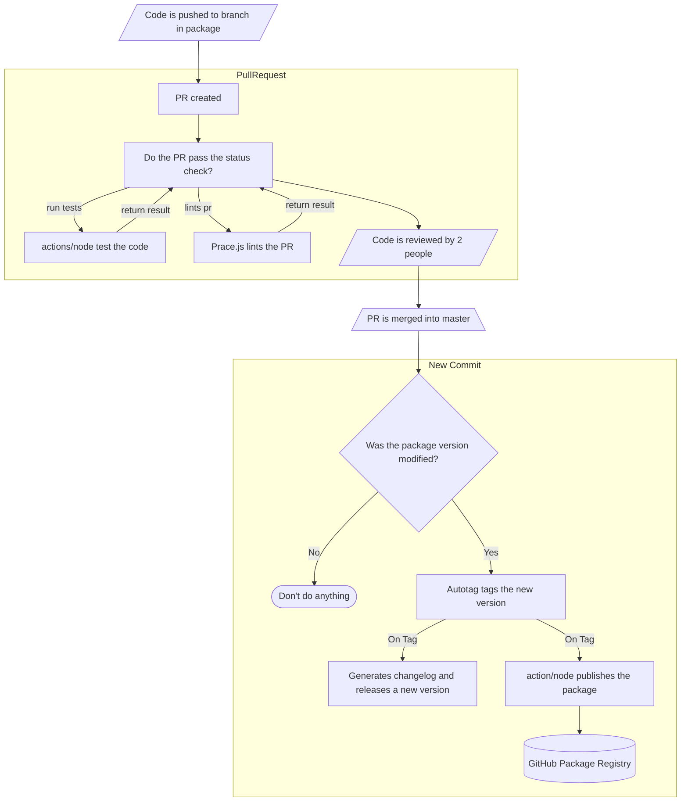

# Deployment process

## How to deploy a new version

To deploy a new version, you need to update the `package.json` version.

This will start the process of automation:

- It will tag the commit with the new package version.
- It will create a changelog with all the changes.
- It will build the package and publish it in our private registry.

### Visual Flow Representation


This repository uses 3 GitHub actions:
- [public-actions/commit-autotag](https://github.bitwa.la/public-actions/commit-autotag): Tags the commits when the `package.json` version changes.
- [public-actions/Prace.js](https://github.bitwa.la/public-actions/Prace.js): Pull Request linter. Ensures that we keep using the correct commit names in our Pull Requests.
- [public-actions/update-node-scoped-dependencies](https://github.bitwa.la/public-actions/update-node-scoped-dependencies): Cron job to check if any dependency has been updated. Ideally, this would be replaced by Dependabot when it is deployed inside GitHub enterprise edition.

# Git rules
Your commit messages have to be in this format:
```
<type>(<scope>): <short summary>
  │       │             │
  │       │             └─⫸ Summary in present tense. Not capitalized. No period at the end.
  │       │
  │       └─⫸ Commit Scope: Typically a common directory prefix.
  │
  └─⫸ Commit Type: build|chore|ci|docs|feat|fix|perf|refactor|test
```

Where `type` is one of the following:
*  `breaking`
*  `build`
*  `ci`
*  `chore`
*  `docs`
*  `feat`
*  `fix`
*  `other`
*  `perf`
*  `refactor`
*  `revert`
*  `style`
*  `test`

### Semantically relevant commits (features & bug fixes)

Here's an example of a typical commit message for a *feature change*, which
would affect the project's version number, create a Git tag and leave an entry
in the file [CHANGELOG.md](CHANGELOG.md) when merged into the main branch:

```
feat(technology/aws): add modules to manage VPC peerings across accounts

This commit adds a pair of modules which can be used to establish a peering
connection between two VPCs located in either the same, or in different AWS
accounts.

The "requestor" account should use the corresponding module and be applied
first, and the "responder" account should use the other module and pass to
it the outputs of the "requestor" module.

ref: https://docs.aws.amazon.com/vpc/latest/peering/what-is-vpc-peering.html
issue: https://bitwala-gmbh.atlassian.net/browse/CBI-9999
```

The keyword **feat** in the commit type field indicates that this is a
*semantically relevant* commit, which should be listed in the *Features*
section of the release notes.

Correspondingly, the keyword **fix** indicates a semantically relevant commit
which appears in the *Bug Fixes* section. A bug fix should ways describe what
was broken before the change, and what the change does to fix the situation.
